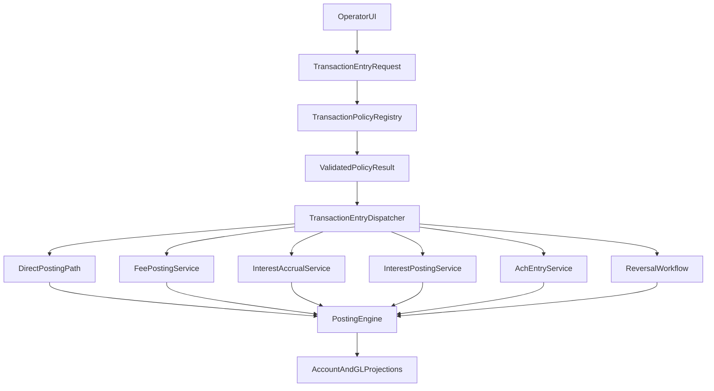

# Transaction Rules And UI Roadmap

## Goal

Turn the documented transaction catalog into an implementation-ready application design that:

- enforces business rules before posting
- dispatches each family through the correct service path
- exposes family-aware workstation UI instead of one generic form for every transaction type
- preserves the posting-first architecture already formalized in the ADR set

## Primary References

- `docs/progress/transaction_requirements_matrix.md`
- `docs/00_initial_core_references/transaction_catalog_spec.md`
- `docs/00_initial_core_references/transaction_posting_spec.md`
- `docs/00_initial_core_references/manual_transaction_entry_model.md`
- `app/controllers/transactions_controller.rb`
- `app/services/manual_transaction_entry_service.rb`

## Current Baseline

The current implementation already has:

- a generic manual transaction workstation in `TransactionsController`
- a posting preview screen in `app/views/transactions/preview.html.erb`
- transaction review and governed reversal from `app/views/transactions/show.html.erb`
- dedicated family services for fees, interest accrual, interest posting, and reversals

The main architecture gap is that generic manual entry still posts directly through `ManualTransactionEntryService`, even when a transaction family has additional records or rules that should be enforced first.

## Target Architecture

## 1. Policy / Validation Layer

### Objective

Introduce a single policy layer between form input and posting/service execution so business-rule enforcement does not remain split across docs, controllers, and family services.

### Recommended Service Shape

Add a transaction-entry namespace under `app/services/transaction_entry/`:

- `request.rb`
- `policy_registry.rb`
- `dispatcher.rb`
- `preview_service.rb`
- `policies/base_policy.rb`
- `policies/adjustment_policy.rb`
- `policies/transfer_policy.rb`
- `policies/fee_policy.rb`
- `policies/interest_accrual_policy.rb`
- `policies/interest_post_policy.rb`
- `policies/ach_policy.rb`
- `policies/reversal_policy.rb`

### Shared Policy Responsibilities

- normalize form input into one request object
- validate business date eligibility
- validate required accounts and routing structure
- validate family-required metadata
- validate approval and exception conditions
- construct a canonical idempotency fingerprint per family
- return a validated policy result that the dispatcher can consume

### Shared Resources

The request object and policy layer should explicitly support shared resources that may be reused across transaction families:

- authorization references
- override requests
- original transaction or posting targets
- fee rules
- interest rules
- external network references such as ACH trace and batch identifiers

Recommended handling:

- model them as first-class fields on the normalized request object, not hidden controller-only params
- let each family policy declare whether the shared resource is required, optional, or forbidden
- preserve them into transaction metadata and reference structures where they matter for auditability
- avoid one monolithic "shared resource" table until the domain proves it is necessary; start with explicit request fields and traceable linkage

### Rules To Centralize First

- active/postable account eligibility
- same-account prohibition for transfers
- required `reason_text` and `reference_number` for operator-entered adjustments
- fee-type/rule requirements for fee posting
- interest rule / cycle requirements for accrual and posting
- ACH trace and effective-date requirements
- reversal threshold, approval, and original-batch eligibility checks

### Key Design Rule

Keep this layer out of `PostingEngine`. The posting engine should still answer "how does it affect money?" while the policy layer answers "is this operational request allowed and complete?"

## 2. Family-Aware Dispatch

### Objective

Replace direct `PostingEngine.post!` usage in `ManualTransactionEntryService` with a dispatcher that routes each family to the correct execution path.

### Recommended Dispatch Model

- adjustments and transfers may remain thin wrappers around direct posting
- fee posting must route through `FeePostingService`
- interest accrual must route through `InterestAccrualService`
- interest posting must route through `InterestPostingService` plus accrual-linking workflow
- ACH should get a dedicated service such as `AchEntryService`
- reversals should remain on their explicit governed flow rather than generic manual entry

### Immediate Refactor Target

Rework `app/services/manual_transaction_entry_service.rb` into either:

- a compatibility wrapper over `TransactionEntry::Dispatcher`, or
- a new `TransactionEntryService` that replaces it directly

### Why This Matters

This closes the current correctness gap where:

- generic `FEE_POST` can bypass `FeeAssessment`
- generic `INT_ACCRUAL` can bypass `InterestAccrual`
- generic `INT_POST` can bypass `InterestPostingApplication`

## 3. Workstation UI Model

### Recommended UI Strategy

Use a hybrid model:

- keep one shared transaction shell for operator-authored single-event entry
- add family-specific partials and rules inside that shell
- give inherently governed or cycle-driven families dedicated workbenches

### Shared Transaction Shell

Continue using:

- `app/views/transactions/new.html.erb`
- `app/views/transactions/preview.html.erb`

But split the form body into family partials such as:

- `_adjustment_fields.html.erb`
- `_transfer_fields.html.erb`
- `_fee_fields.html.erb`
- `_ach_fields.html.erb`
- `_shared_metadata_fields.html.erb`

The shell should remain responsible for:

- transaction family selection
- common operator metadata
- preview vs confirm flow
- rendering policy warnings and validation guidance

### Dedicated Workbenches

Use dedicated screens instead of free-form generic entry for:

- interest accrual runs
- interest posting runs
- reversal preview/confirm

Recommended controller directions:

- keep `TransactionsController` for manual entry shell, preview, list, and transaction review
- add a dedicated reversal preview path, either inside `TransactionsController` or as a `ReversalsController`
- extend the current interest review surfaces into operator actions:
  - `InterestAccrualsController` for due-account review and run actions
  - a new `InterestPostingsController` for due-accrual review and posting-cycle runs

### Family-Specific UI Requirements

#### Adjustments

- explicit credit vs debit guidance
- linked prior issue or case reference
- threshold warning for higher-risk debits

#### Transfers

- source/destination validation
- contra-account summary in preview
- transfer narrative that matches account-history expectations

#### Fees

- fee type selector
- optional amount override
- rule/source explanation
- original fee linkage for reversals
- waiver or override reason when applicable

#### Interest

- due items and cycle context, not just free-form amount entry
- visibility into which accruals or rules are being acted on
- operator explanation of whether the action is system-generated, operator-triggered, or blocked

#### ACH

- ACH trace number
- authorization reference
- originator or authorization reference
- effective date
- batch/file reference
- explicit blocked-account or policy-failure messaging

#### Reversals

- preview of inverse posting impact
- clear approval-threshold messaging before submit
- direct linkage to override request status when approval is required

### Shared Resources In The UI

The shared transaction shell should support rendering shared-resource sections when a family requires them, for example:

- an authorization section for ACH or other authorization-dependent families
- an override section when policy review or supervisor approval is already in play
- a rule-context section when fees or interest derive from `fee_rule_id` or `interest_rule_id`
- an original-transaction section for reversals and correction-style workflows

This keeps the UI consistent without flattening every family into the same field set.

## 4. Review And Navigation Surfaces

The roadmap should treat these existing review surfaces as part of the transaction workbench, not separate dead ends:

- `app/views/transactions/show.html.erb`
- `app/views/accounts/show.html.erb`
- `app/views/fee_assessments/index.html.erb`
- `app/views/interest_accruals/index.html.erb`
- override request screens under `OverrideRequestsController`

Recommended improvements:

- link fee history rows back into manual fee-post and fee-reversal flows
- link accrual history into accrual review and interest-post review flows
- surface transaction family shortcuts from account review where they are operationally appropriate
- keep transaction review as the canonical place to inspect structured references, exceptions, and reversal eligibility

## 5. Delivery Order

### Phase A: Matrix And Policy Skeleton

- ship `docs/progress/transaction_requirements_matrix.md`
- add request object, registry, and family policies
- keep current UI behavior initially, but start enforcing missing requirements before submit/post

### Phase B: Adjustments, Transfers, And Reversals

- move manual entry shell to policy-backed family partials
- keep adjustments and transfers on the shared shell
- add explicit reversal preview/confirm workflow

### Phase C: Fee Workflows

- add fee family partials to the transaction shell
- route fee submit through `FeePostingService`
- ensure manual fee posting creates `FeeAssessment`
- add fee-reversal family behavior instead of treating it as a plain generic code

### Phase D: Interest Workflows

- stop using generic free-form entry for interest accrual/post
- add dedicated accrual and posting workbenches
- ensure posting path creates `InterestAccrual` and `InterestPostingApplication` records consistently

### Phase E: ACH Workflows

- add ACH family partials or dedicated entry surface
- implement ACH entry service and validations
- defer returns/disputes until external clearing detail is intentionally in scope

## 6. Testing Strategy

### Unit Tests

- policy object tests for required fields, eligibility, approvals, and idempotency fingerprints
- dispatcher tests proving each family resolves to the correct service path

### Service Tests

- fee, interest, ACH, and reversal family tests that prove side records and posting outputs stay aligned

### Controller / Integration Tests

- transaction shell rendering by family
- preview/confirm behavior
- reversal preview/override redirects
- dedicated interest workbench submit paths

### End-To-End Flow Tests

- adjustment and transfer posting from UI through projections
- fee post resulting in both posting and `FeeAssessment`
- interest accrual/post resulting in both posting and accrual-linkage records
- governed reversal with override requirement
- ACH entry with required metadata and transaction review visibility

## 7. Recommended First Implementation Slice

Do not start with UI alone.

Start with:

1. request object
2. policy registry
3. adjustment/transfer/reversal policy coverage
4. shared transaction shell partials for those families

That first slice gives the team:

- a reusable pattern
- immediate operator UX improvement
- lower risk than starting with fee or interest flows that already depend on family side records

## Practical Conclusion

The docs already define what these transactions mean. The next implementation phase should make that meaning executable.

The core rule for this roadmap is:

> every transaction family should collect the right operational inputs, pass through explicit policy validation, dispatch through the correct family path, and only then create financial truth through the posting engine.
